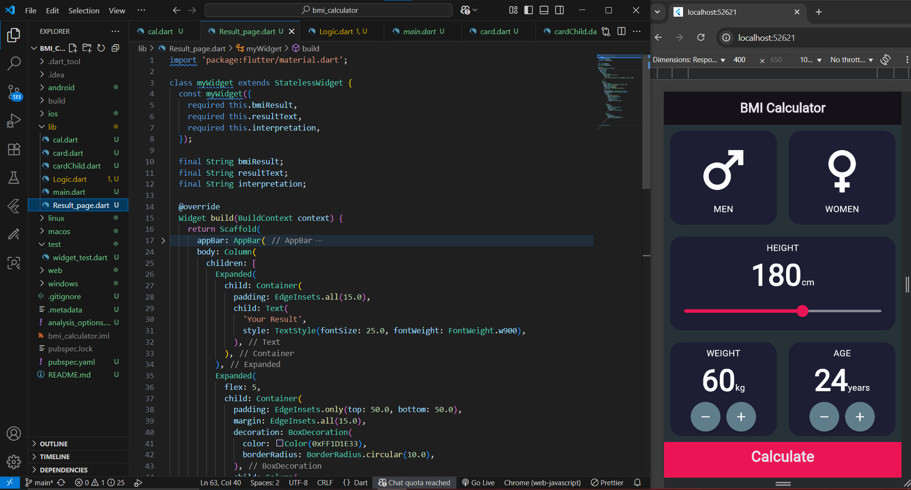
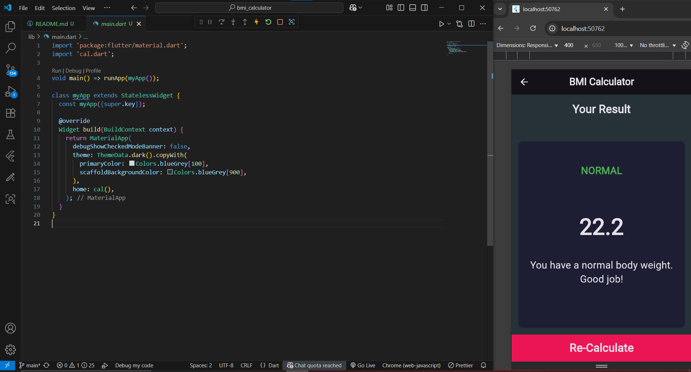

# ⚖️ BMI Calculator - Flutter App

A Body Mass Index (BMI) Calculator built with Flutter.
It allows users to input their height, weight, age, and gender, and then calculates their BMI with interpretation results.

## 🚀 Features

👤 Select Male/Female gender

📏 Adjust Height with a slider

⚖️ Adjust Weight with increment/decrement buttons

🎂 Adjust Age with increment/decrement buttons

📊 Calculates BMI and shows results on a new page

🎨 Clean UI inspired by modern design

## 📸 Screenshots

Input Page

Result Page

