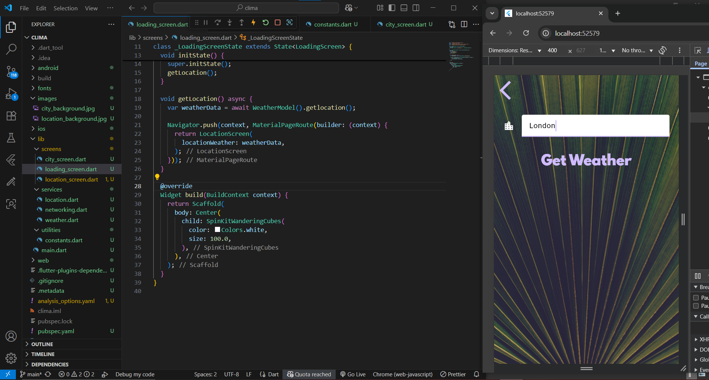

# ☁️ Clima - Flutter App

A simple weather app built with Flutter that shows live weather data for your current location or any city you search for.

## ✨ Features

📍 Get live weather using device location

🏙️ Search weather by city name

🌡️ Fetch real-time data from OpenWeatherMap API

📡 Learn async/await, Futures, JSON parsing, and networking in Dart

🎨 Clean and modern UI design

## 📸 Screenshot (Sample)

