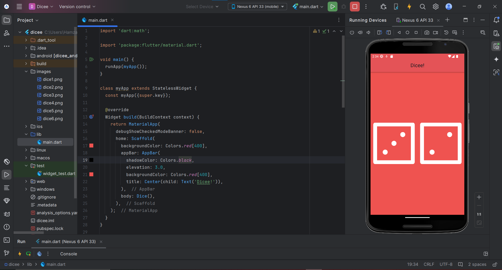

# 🎲 Dicee - Flutter Dice App

A simple Flutter app that simulates rolling dice.  
The app has an **AppBar** and two dice images in the center.  
When you tap on either die, both dice are randomized to show a new number between **1 and 6**.

---

## ✨ Features

- 🎨 Clean UI with AppBar and Center display.
- 🎲 Two dice images displayed at the center.
- 👆 Tap on any dice to roll both at the same time.
- 🔀 Randomization logic ensures values between 1–6.

---

## 📸 Screenshot (Sample)

---
