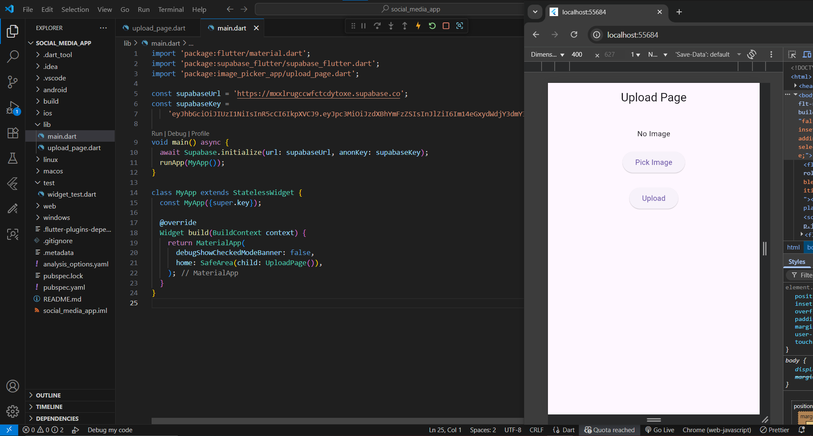

# 📤 Flutter Image Upload with Supabase

A simple Flutter app to pick an image from the gallery and upload it to Supabase Storage.

## ✨ Features

🖼️ Pick images from gallery using image_picker

☁️ Upload files to Supabase Storage bucket (images)

📂 Auto-generates unique filenames using timestamps

✅ Snackbar feedback on successful upload

🎨 Preview selected image before uploading

## 📸 Screenshot (Sample)

