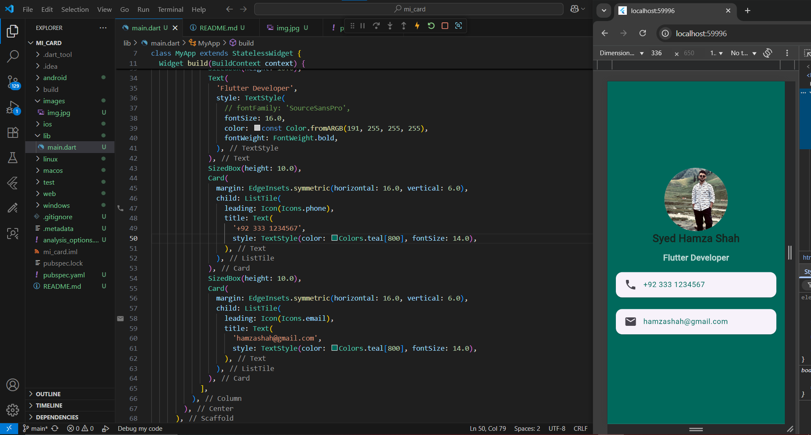

# 🪪 MiCard - Flutter Profile Card App

A simple Flutter app that displays a **digital business card**.  
The app shows a profile picture, name, profession, and contact details in a clean card-style layout.

---

## ✨ Features

- 🎨 Clean UI with a teal-themed background.
- 👤 Circular profile picture at the top.
- 📝 Name and profession displayed with styled text.
- 📞 Contact info (phone & email) inside neat cards with icons.
- 📐 Centered and responsive layout.

---

## 📸 Screenshot (Sample)

---
