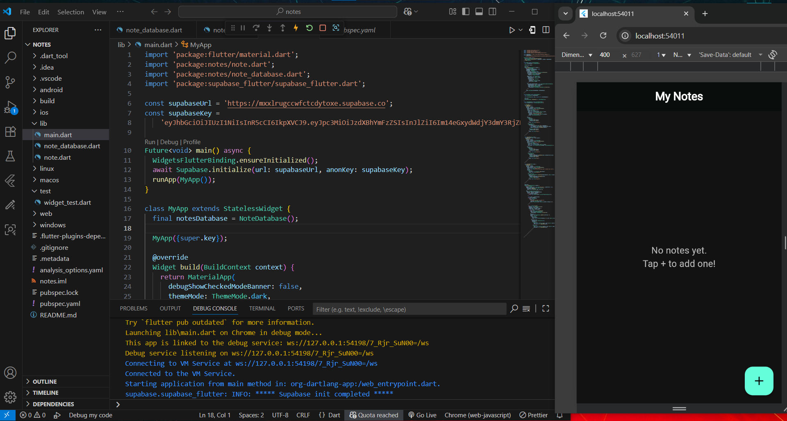
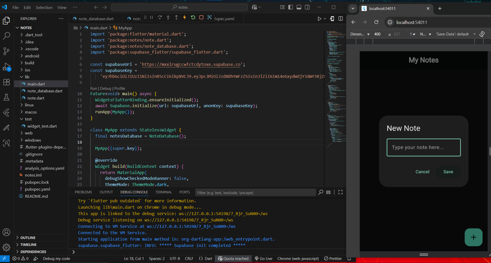

# 📝 Flutter Notes App with Supabase

A simple cloud-synced notes app built with Flutter and Supabase.
Add, update, and delete notes with real-time updates.

## ✨ Features

☁️ Supabase backend for authentication & storage

📝 Create, edit, and delete notes

🔄 Realtime sync across devices

🎨 Dark themed UI with custom styling

⚡ Uses StreamBuilder for live updates

## 📸 Screenshot (Sample)

