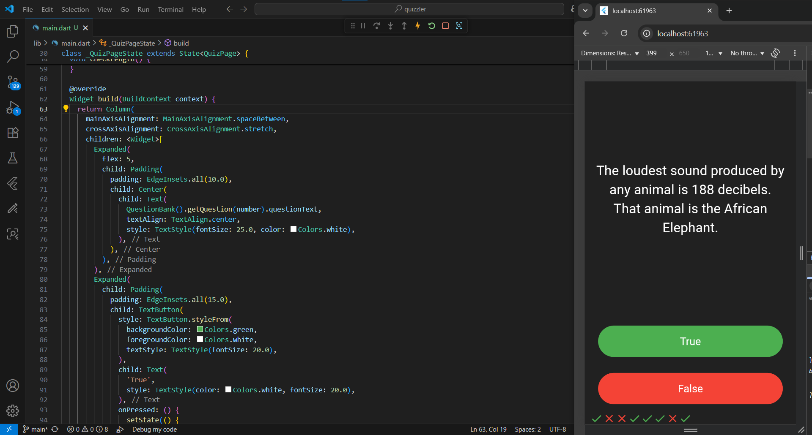
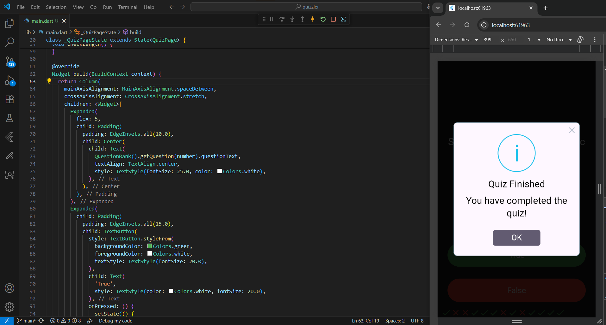

# 📚 Quizzler - Flutter Quiz App

A simple quiz application built with Flutter that allows users to answer True/False questions and keeps track of their scores.
It uses the rflutter_alert
package to show an alert when the quiz is finished.

## 🚀 Features

✅ Interactive True/False quiz
✅ Score tracking with icons (✔️ and ❌)
✅ Alert dialog when quiz is completed
✅ Clean and minimal UI design

## 📸 Screenshots

Quiz Question

Quiz Finished Alert

