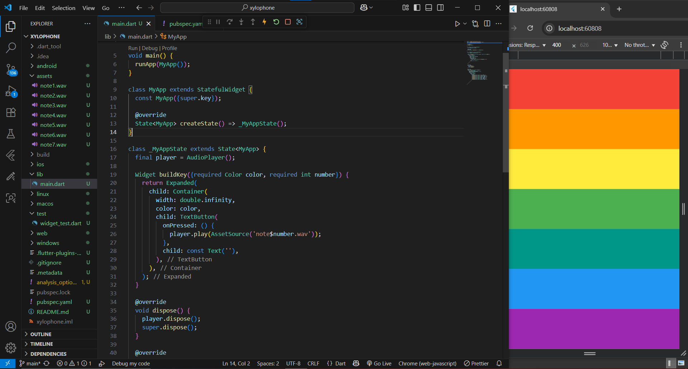

# 🎹 Xylophone - Flutter App

A simple Flutter app that turns your device into a **colorful xylophone**.  
Tap on the rainbow-colored keys to play musical notes 🎶.

---

## ✨ Features

- 🎨 Seven rainbow-colored keys (Red → Purple).
- 🎵 Each key plays a unique sound (`note1.wav` → `note7.wav`).
- 📱 Responsive full-width keys using `Expanded`.
- ⚡ Lightweight and easy-to-use audio playback with `audioplayers`.

---

## 📸 Screenshot (Sample)

---
